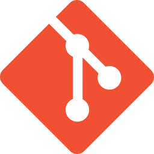

## Hi there 👋, I'm Mikołaj Badyl
### Connect with me:
[&nbsp;&nbsp;&nbsp;&nbsp;](https://play.google.com/store/apps/dev?id=7820499561754221571)
[&nbsp;&nbsp;&nbsp;&nbsp;](https://discordapp.com/users/412617753854345217)

### Languages and frameworks:
[&nbsp;&nbsp;&nbsp;&nbsp;](https://dart.dev/)
[&nbsp;&nbsp;&nbsp;&nbsp;](https://flutter.dev/)
[&nbsp;&nbsp;&nbsp;&nbsp;](https://www.python.org/)
[&nbsp;&nbsp;&nbsp;&nbsp;](https://www.gnu.org/software/bash/)
[&nbsp;&nbsp;&nbsp;&nbsp;]()
[&nbsp;&nbsp;&nbsp;&nbsp;]()
[&nbsp;&nbsp;&nbsp;&nbsp;]()

### Tools:
[&nbsp;&nbsp;&nbsp;&nbsp;](https://code.visualstudio.com/)
[&nbsp;&nbsp;&nbsp;&nbsp;](https://www.jetbrains.com/pycharm/)
[&nbsp;&nbsp;](https://git-scm.com/)
[&nbsp;&nbsp;&nbsp;&nbsp;](https://archlinux.org/)
[&nbsp;&nbsp;&nbsp;&nbsp;](https://ubuntu.com/)
[&nbsp;&nbsp;&nbsp;&nbsp;](https://www.microsoft.com/pl-pl/windows)
